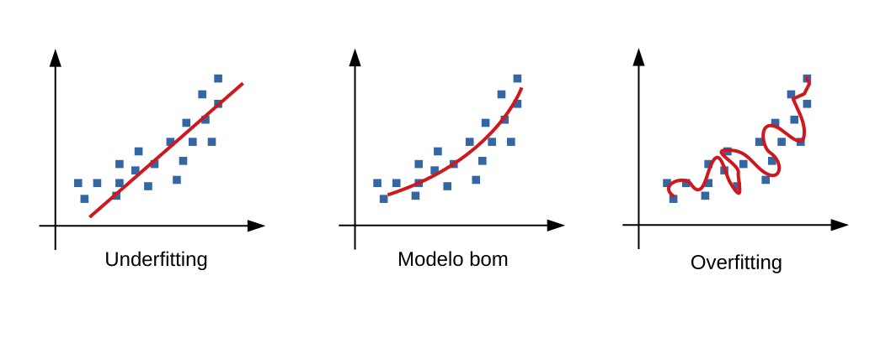
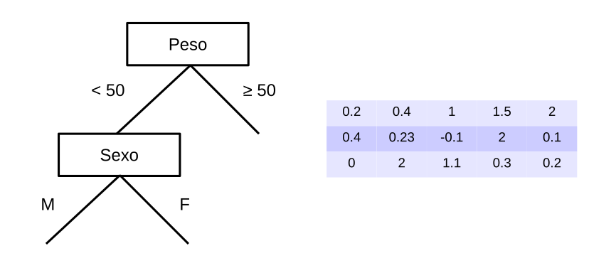

 # Inteligência Artificial
 
Escreva um programa que retorne as raizes de uma equação de segundo grau. Escreva um programa que calcula a menor rota entre dois pontos. Escreva um programa que auxilie uma empresa de transporte a minimizar o tempo de entrega e os gastos com combustível. Escreva um programa que reconheça pessoas pelo rosto ou pela fala. Escreva um programa para dirigir um carro de forma autônoma. Escreva um programa para idenitificar buracos negros. Escreva um programa que controle os jogadores de um time de futebol de robôs. Escreva um programa que jogue Dota 2 e seja melhor que o melhor jogador humano. 

Qual estrutura de dados esses programas utilizam? Qual a complexidade desses algoritmos? O que eles tem de similares? O que eles tem de diferentes? Existe mais de um algoritmo que resolve o mesmo problema? Você consegue pensar em pelo menos uma solução para cada problema? O ser humano consegue resolver todos esses problemas? Como o ser humano consegue resolver todos esses problemas? Responder essas perguntas pode ser relativamente difícil, portanto vamos assumir algumas premissas antes de começar. A primeira dela é que o ser humano consegue realizar boa parte das tarefas diárias porque ele é bom em reconhecer padrões. 

Padrões no discionário Michaelis on-line é "aquilo que tem forma, tamanho, dimensões mais comuns em sua categoria ou em seu gênero; modelo, tipo". Um médico consegue, com um conjunto de sintomas e de resultados de exames clínicos, diagnosticar se um paciente esta com algum problema cardíaco. Para isso ele utiliza o conhecimento adiquirido durante os 6 anos de formação e sua experiencia durante o exercício da profissão. É provavel que somente utilizando o conhecimento adiquirido nos livros o médico fosse capaz de diagnosticar. Mas será que a experiência também não é importante? 

Nos primórdios da Inteligência Artificial (IA), por volta de 1970, esses conhecimentos eram extraidos dos especialistas e regras lógicas eram construídas de forma a possibilitar a automatização das tarefas, sejam elas de diagnósticos de doenças, predizer se o banco deveria ou não emprestar dinheiro para uma pessoa e etc. Ou seja, o processo de aquisição de conhecimento normalmente envolvia entrevistas e a cooperação por parte do especialsta resultado em uma tarefa completamente subjetiva.

Nas últimas décadas, a expansão da coleta de dados, o crescimento dos volumes de dados coletados, a necessidade de processamento desses dados e extração de conhecimento de forma automática, surgiu a necessidade de automatizar a extração de conhecimento. Ou seja, surgiu a necessidade de ferramentas que fossem capazes de criar por sí próprias, a partir de experiencia passada, uma hipótese ou função capaz de resolver um determinado problema. Uma hipótese ou função pode ser um regra ou conjunto de regras que descrevem o comportamento de um problema em relação a algum comportamento esperado. Esse processo de construção/indução de uma hipótese ou função recebe o nome de Aprendizado de Máquina (AM).

Uma das definições classicas de AM foi dada por Mitchell em 1997 no livro *Machine Learning*: "Aprendizado de Máquina é a capacidade de melhorar o desempenho na realização de uma tarefa por meio da experiência". Ou seja, esperamos um comportamento inteligente quando temos a capacidade de memorizar, observar e aprender fatos por meio de práticas de organização do conhecimento em novas representações.

Imagine uma base de dados que contém exemplos de equações de segundo grau 
 e suas raizes 
 e . Nessa base de dados, cada linha representa uma amostra/dado/objeto e cada coluna/variável/atributo uma característica relacionada a essa amostra. Perceba que as três primeiras colunas são os índices das equações de segundo grau e as duas últimas colunas as raizes.

O conjunto de dados *Jogar Tênis* é um problema de classificação binária aonde pretende-se classificar se uma pessoa deve ou não, dado certas condições climáticas, jogar tênis. Nessa base de dados, cada linha representa uma amostra/dado/objeto e cada coluna/variável/atributo uma característica relacionada a essa amostra. Os atributos de entrada são o *Tempo*, *Temperatura*, *Umidade* e *Vento*. O conjunto tem 14 amostras de treinamento e a última coluna denominada *Joga* representa os rótulos jogar ou não tênis.

 *Base de dados Jogar Tênis. Adaptado de Katti Faceli et al., (2011)*

Naturalmente podemos contratar um climatólogo expert em tênis para nos dizer quando e onde devemos jogar tênis baseado em muitos modelos climáticos e matemáticos. Provavelmente ele usuaria uma formula matemática complexa e muito difícil de ser aplicada. Outra alternativa seria utilizar o aprendizado indutivo.

Indução no discionário Michaels significa "forma de raciocínio que leva à conclusão de um certo caso com base na observação da regularidade de uma ocorrência". Ou seja, podemos entender que os algoritmos de Aprendizado de Máquina aprendem por meio da experiência, ou seja, aprendizado indutivo. Quando um algoritmo de Aprendizado de Máquina esta aprendendo a partir de um conjunto de dados, ele esta procurando uma hipótese, no espaço de possíveis hipóteses, capaz de descrever as relações entre objetos e que melhor se ajuste aos dados.

Exemplos de aprendizado indutivo:
* Seu pai quando diz que o melhor lugar para pescar é na rocha próximo a curva do rio
* Seu avô quando olha para o céu e diz que vai chover em 20 minutos
* Sua avó quando diz que andar de moto é perigoso

## Indução da Hipótese ou Função

O que se deseja é construir uma hipótese capaz de predizer se devemos ou não jogar tênis para uma amostra antes nunca vista. Assim, uma vez induzida uma hipótese, é esperado que ela também seja valida para outras amostras do mesmo domínio mas que não fazem do conjunto de treinamento. A essa capacidade da hipótese continuar valendo para outros objetos dá-se o nome de capacidade de generalização da hipótese. 

O objetivo de um algoritmo de AM utilizado nessa tarefa é aprender, a partir de um subconjunto dos dados, um modelo, hipótese ou função capaz de relacionar os valores dos atributos de entrada de um objeto ao valor do seu atributo de saída. Além disso é importante que os algoritmos de AM sejam capazes de lidar com dados imperfeitos. Muitos conjuntos de dados apresentam algum tipo de imperfeição como presença de ruídos, dados ausentes e redundantes.

Quando uma hipótese apresenta baixa capacidade de generalização, pode ser que ela esteja superajustada aos dados (overfitting). Também podemos dizer que a hipótese memorizou os dados. Quando a hipótese aprensenta baixa capacidade de generalização inclusive no conjunto de treianmento, dizemos que ela subajustou aos dados (underfitting). Essa condição pode acontecer quando o conjunto de treinamento é pequeno e pouco representativo ou o algoritmo utilizado para construir a hipótese é muito simples. A Figura a seguir apresenta exemplos de *overfitting*, *underfitting* e um hipótese ideal.

 
*Exemplo de hipóteses para uma base de dados. Adaptado de https://medium.com/greyatom/what-is-underfitting-and-overfitting-in-machine-learning-and-how-to-deal-with-it-6803a989c76*

## Viés dos Algoritmos

Sem viés não haverá aprendizado. Portanto, todos os algoritmos de AM apresentam algum viés. Viés pode ser definido como caracteristicas que restringem as hipóteses que serão visitadas no espaço de busca pelo algoritmo. Segundo Mitchell (1997) o viés permite que o algoritmo generalize o conhecimento adquirido durante a fase de treinamento para aplicá-lo com sucesso aos novos dados. Assim, cada algoritmo de AM apresenta dois viés, o de representação e o de busca.

### Viés de Representação

O viés de representação está associado a forma como cada algoritmo de AM representa o conhecimento para descrever a hipótese induzida. A Árvore de Decisão (AD) representa o conhecimento por meio de regras representadas por nós em uma árvore. Essas regras são perguntas a respeito de um atributo e cada nó folha esta associado a uma classe da base de dados. Quando um novo exemplo é apresentado a esse modelo, a   

 
*Exemplo de viés de representação para uma AD e Redes Neurais. Adaptado de Katti Faceli et al., (2011)*

### Viés de Busca

## Classificação do Aprendizado

