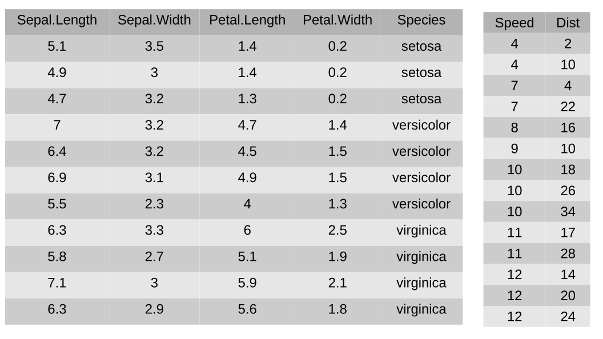
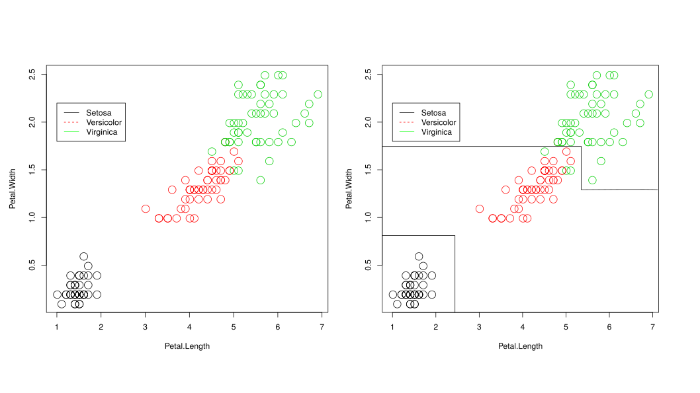

 # Aprendizado de Máquina

Aprendizado de Máquina (AM) pode ser definido formalmente como uma função  que aproxima  capaz de construir um estimador dado um conjunto de dados   . Portanto, podemos dizer que . É importante ressaltar que  é uma função desconhecida e que  permite estimar .

Formalmente um problema supervisionado pode ser representado por um conjunto  em que  é uma matriz representando os atributos preditivos e  é um vetor representando o atributo alvo. Quando o problema é de classificação, ou seja, os rótulos são valores nominais, temos  onde  representa os *l* atributos de saída da base de dados. Quando o problema é de regressão, ou seja, os rótulos são valores reais infinitos e ordenados, temos . Enquanto nos problemas de classificação  nos problemas de regressão temos 

O viés de busca e representação da técnica de AM define como  será encotrada. Além disso, ela pode ser representada por regras, expressões lógicas, polinômios e etc. Portanto, diferentes algoritmos de AM irão encontrar diferentes fronteiras. Além disso, diferenças nos conjuntos de dados de treinamento, variações na ordem de apresentação, diferentes valores de parâmetros das técnicas e processos internos estocásticos podem fazer com que um mesmo algoritmo de AM encontre fronteiras diferentes.

As duas Tabelas a seguir mostram bases de dados supervisonadas. A Tabela da esquerda mostra um subconjunto de amostras da base de dados *iris*. Essa base é composta por 4 atributos  preditivos numéricos relacionados as características das flores dessa espécie e 150 amostras. A base é multiclasse por apresentar 3 classes: *setosa*, *virgínica* e versicolor*. A base é balanceada, pois apresenta 50 amostras por classe. A Tabela da esquerda mostra um subconjunto de amostras da base de dados *cars*.  Essa base é composta por um atributo alvo numérico que reprensenta a velocidade de um carro e um atributo preditovo numérico relacionado a distância que um determinado carro percorre até parar completamentamente depois que os freios foram acionados. Além disso, a base tem 50 amostras.

A Figura a seguir esta relacionada a base de dados *Iris*. Ela mostra a mesma base de dados em um gráfico de dispersão para os dois atributos mais informativos da base, o tamanho e largura da sepala. Também é apresentado uma função  induzida por algum algoritmo de AM.

 *Tabela da base de dados Iris e Cars.*

 *Gráfico de dispersão da base de dados Iris e uma função f' qualquer.*

A Figura a seguir esta relacionada a base de dados *Cars*. Ela mostra a mesma base de dados em um gráfico de dispersão para os dois atributos da base. Também é apresentado uma função  induzida por algum algoritmo de AM.

 *Gráfico de dispersão da base de dados Cars e uma função f' qualquer.*

