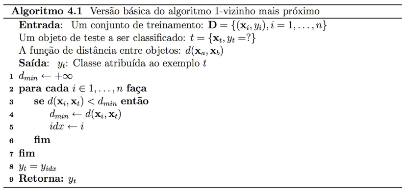
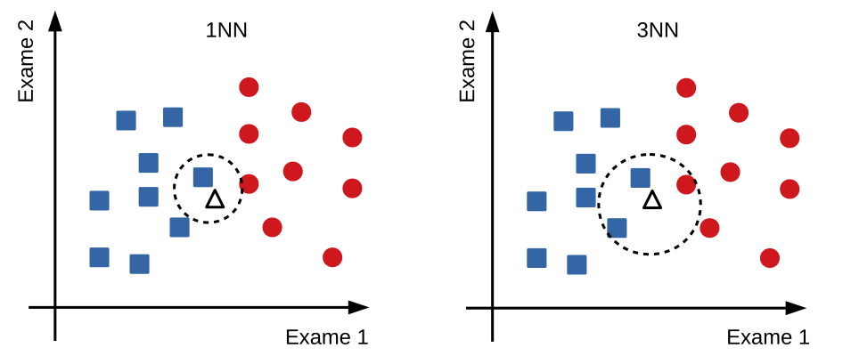

# k-Vizinhos Mais Próximos

A motivação fundamental das técnicas baseadas em vizinhança é que dados similares tendem a estar concentrados em uma mesma região no espaço de entrada. Por espaço de entrada, podemos entender os atributos preditivos da base. Na técnica k-vizinhos mais próximos (kNN), cada objeto representa um ponto no espaço definido pelos atributos de entrada. Uma vez definida uma métrica de similaridade, é possível calcular a distância entre cada dois pontos. A métrica mais utilizada é a distância Euclidiana mostrada na fórmula a seguir. Nessa fórmula,  e   são objetos representados por  atributos.  

A variação mais simples do algoritmo kNN é o 1NN apresentado na sequência. Na fase de treinamento, o algoritmo memoriza os exemplos rotulados da base de dados. Na fase de teste, quando um exemplo não rotulado é apresentado para o algoritmo, é calculada a distância entre esse novo exemplo e cada um dos exemplos rotulados da base de treinamento. O rótulo da classe associado ao exemplo de treinamento mais próximo do exemplo de teste é utilizado para classificar o novo exemplo.

 
*Algoritmo do 1NN. Adaptado de Katti Faceli et al., (2011)*

A extensão imediata do 1NN é o kNN, aonde *k* objetos mais próximos são considerados. Nessa nova configuração, a previsão dos diferentes vizinhos mais próximos são agregadas de forma a classificar a amostra de teste. A forma mais comum para agregar os votos é por maioria. Para evitar empates na votação é comum escolher valores pequenos e ímpares para *k*. 

A Figura a seguir mostra a aplicação do algoritmo 1NN e 3NN em um problema binário. Nessa base, cada amostra pode ser considerada saudável (círculos vermelhos) e doentes (quadrados azuis). O espaço de entrada é definido pelos dois atributos que estão relacionados ao Exame 1 e 2. O triângulo branco representa o exemplo de teste a ser rotulado. Utilizando o algoritmo 1NN com distância euclidiana, podemos definir o vizinho mais próximo como sendo da classe quadrado azul. Utilizando o algoritmo 3NN com distância euclidiana e voto por maioria, podemos definir o rótulo do exemplo de teste como sendo quadrado azul.

 
*Exemplo ilustrativo do 1NN e 3NN para uma base binária*

As principais vantagens desse algoritmo são: a fase de treinamento é simples porque armazena o conjunto de treinamento; é aplicável em quase qualquer problema; e o algoritmo pode ser incremental, ou seja, novos exemplos de treinamento podem ser adicionados naturalmente sem retreinamento. As principais desvantagens são: o algoritmo não constrói um modelo explícito sobre os dados; a predição é custosa por exigir o cálculo da distância entre todas as amostradas da base de dados; pode ser influenciado pelos atributos caso eles não sejam normalizados; e a dimensionalidade muito alta pode impactar negativamente o desempenho do algoritmo por conta da função de distância utilizada.

## Links úteis

Versões eficientes desse mesmo algoritmo:
* [kNN](https://scikit-learn.org/stable/modules/generated/sklearn.neighbors.KNeighborsClassifier.html)
* [BallTree](https://en.wikipedia.org/wiki/Ball_tree)
* [k-d tree](https://en.wikipedia.org/wiki/K-d_tree)